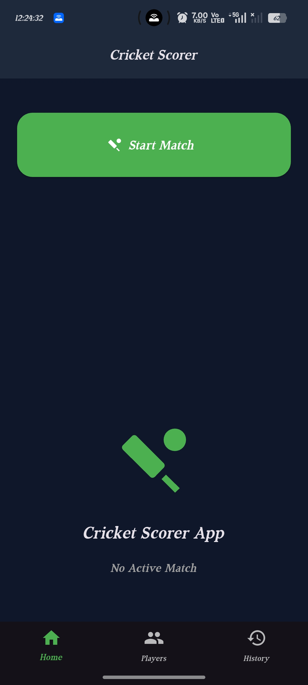
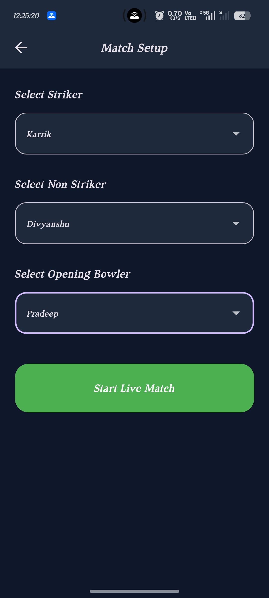
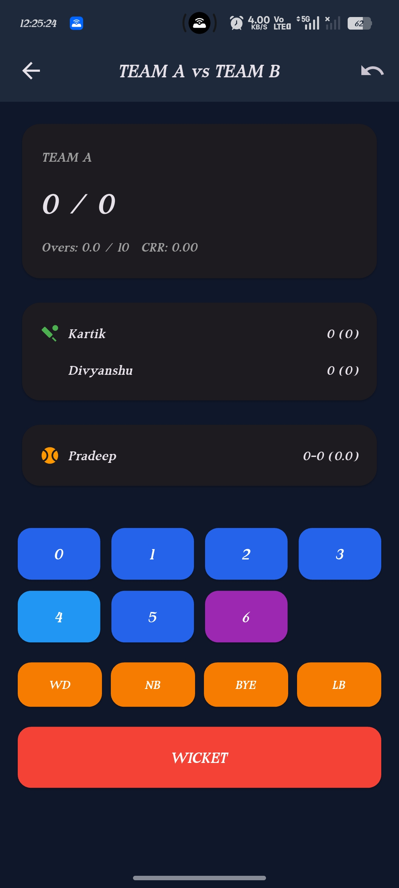
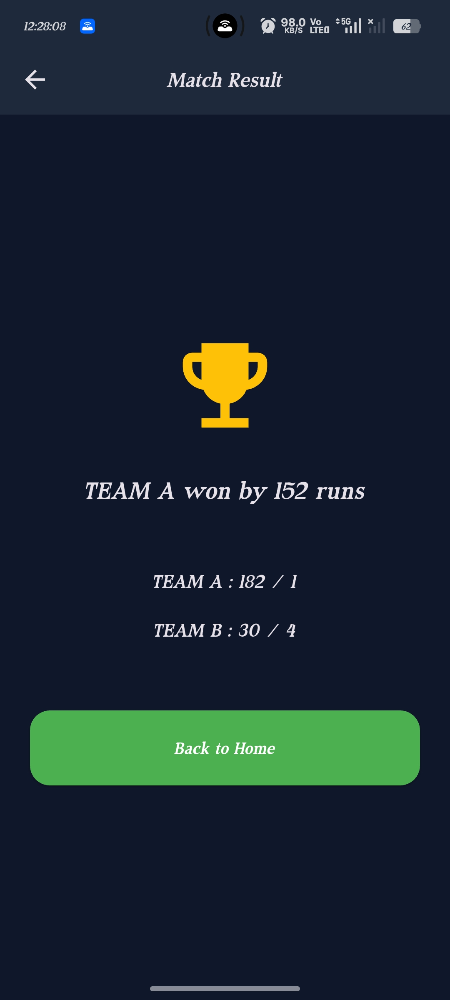
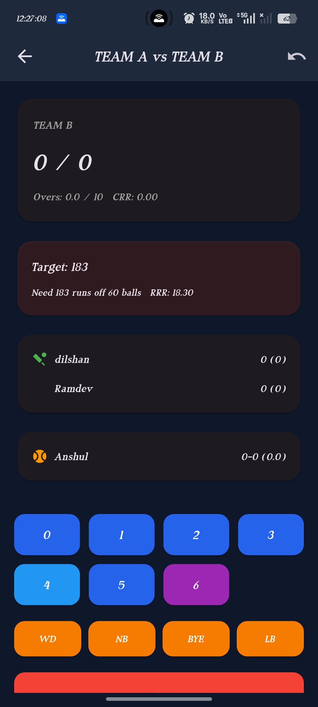

# 🏏 Cricket Scorer


A modern Flutter-based Cricket Scorer application designed for real-time match scoring, player statistics, innings management, and offline match storage. The app delivers a smooth scoring experience with a clean and responsive user interface.

## 📱 Overview

Cricket Scorer is a Flutter application that allows users to score cricket matches in real time while maintaining player statistics, innings information, bowling figures, and complete match details.

The application focuses on providing an intuitive UI with offline data storage and smooth match management.
## 📥 Download APK

➡️ **[Download Latest APK](https://github.com/KartikSharma-tech/cricket_scorer/releases/latest)**
## ✨ Features

- 🏏 Live Ball-by-Ball Scoring
- 👥 Team & Player Management
- 🔄 Strike Rotation
- 🏆 Complete Innings Management
- 🎯 Target Calculation
- 📊 CRR & RRR Calculation
- 📈 Batting Strike Rate
- 🎳 Bowling Economy
- ➕ Extras (Wide, No Ball, Bye & Leg Bye)
- 🚫 Wicket Management
- ↩️ Undo Last Ball
- 💾 Offline Match Storage using Hive
- 📱 Responsive Flutter UI
- - 📜 Match History
- 🧮 Automatic Match Result Generation

---

## 🛠 Tech Stack

- Flutter
- Dart
- Hive
- Material Design
- SharedPreferences

---

## 📂 Project Structure

```text
lib/
├── models/
├── screens/
├── services/
├── utils/
├── widgets/
└── main.dart
```

---

## 🚀 Getting Started

```bash
flutter pub get

flutter run
```

## 📸 Screenshots

### 🏠 Home Screen



---

### ⚙️ Match Setup



---

### 📊 Scorecard



---

### 🏆 Match Result



---

### 🏏 Second Innings


---

## 📌 Future Improvements

- Scorecard Export
- Player Statistics
- Live Match Sharing
- Firebase Cloud Sync
- PDF Scorecard Export
- Live Online Scoring
- Player Performance Analytics
- Team Management

---

## 👨‍💻 Developer

**Kartik Sharma**

Flutter Developer

📧 sharmakartik86000@gmail.com

🔗 GitHub
https://github.com/KartikSharma-tech
